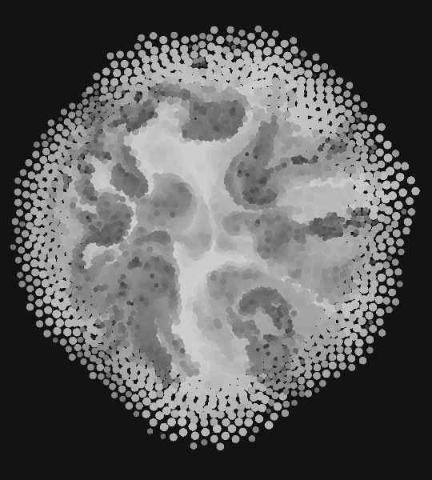

pharticle-d
=========
simple pharticle engine in D programming language. 

## Pipeline
1. CollisionDetector
2. ConstraintSolver
3. Integrator

##require
- [armos](https://github.com/tanitta/armos);
